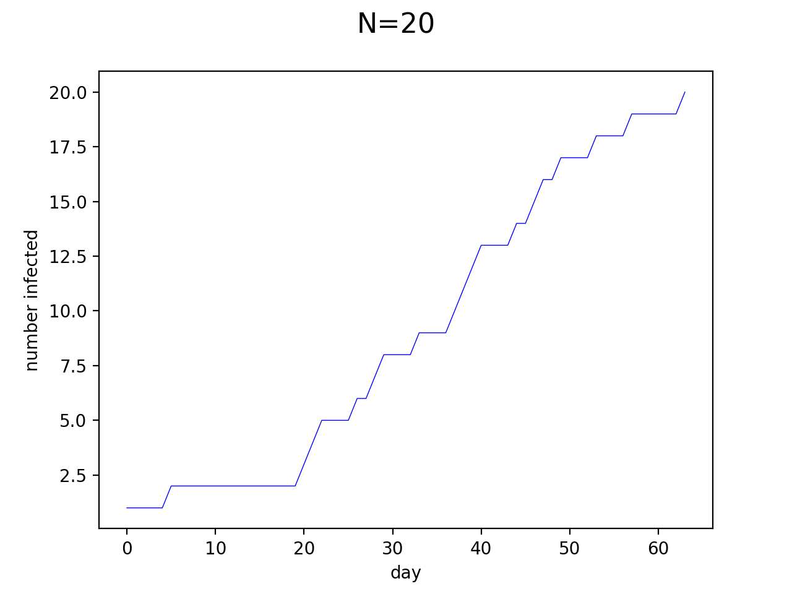
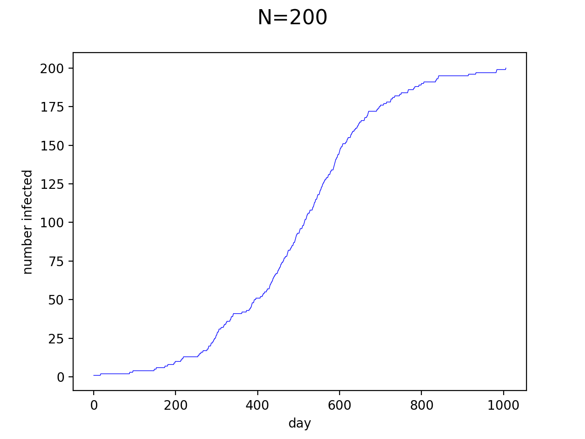
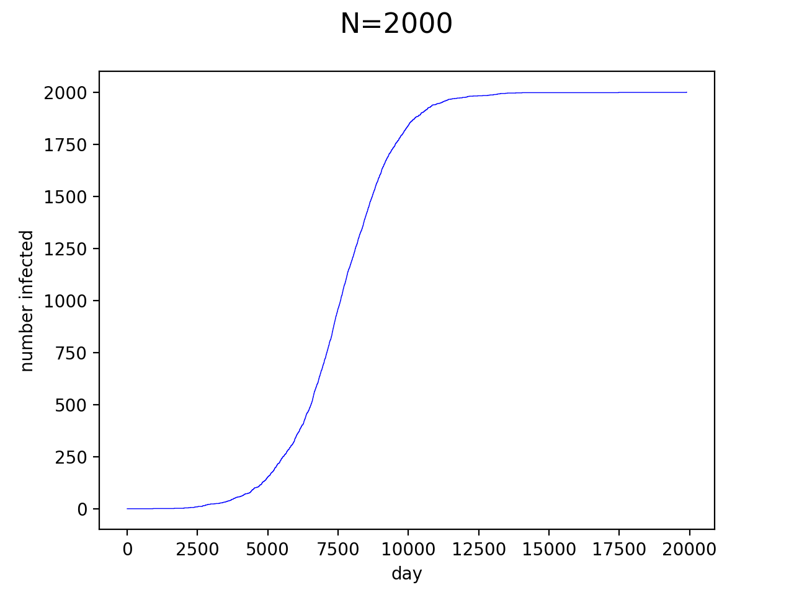
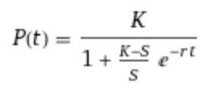
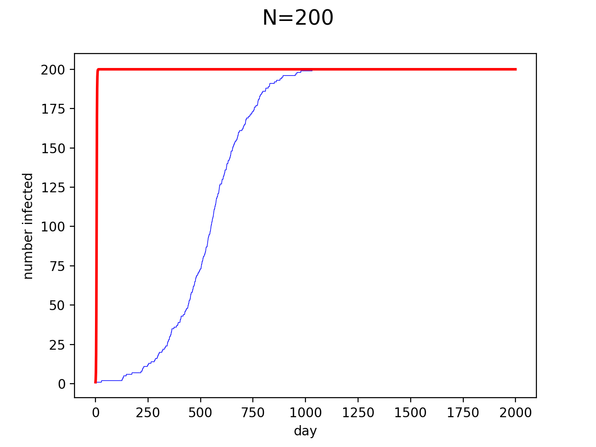
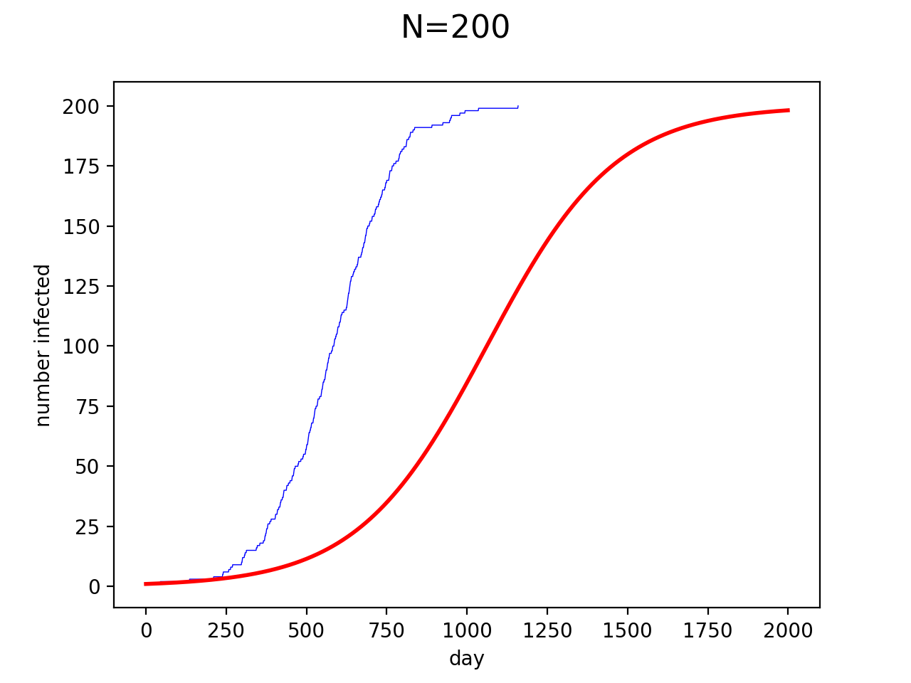
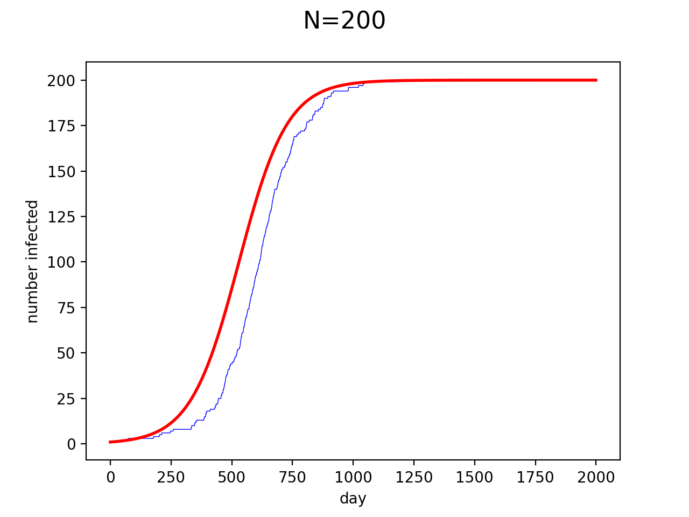
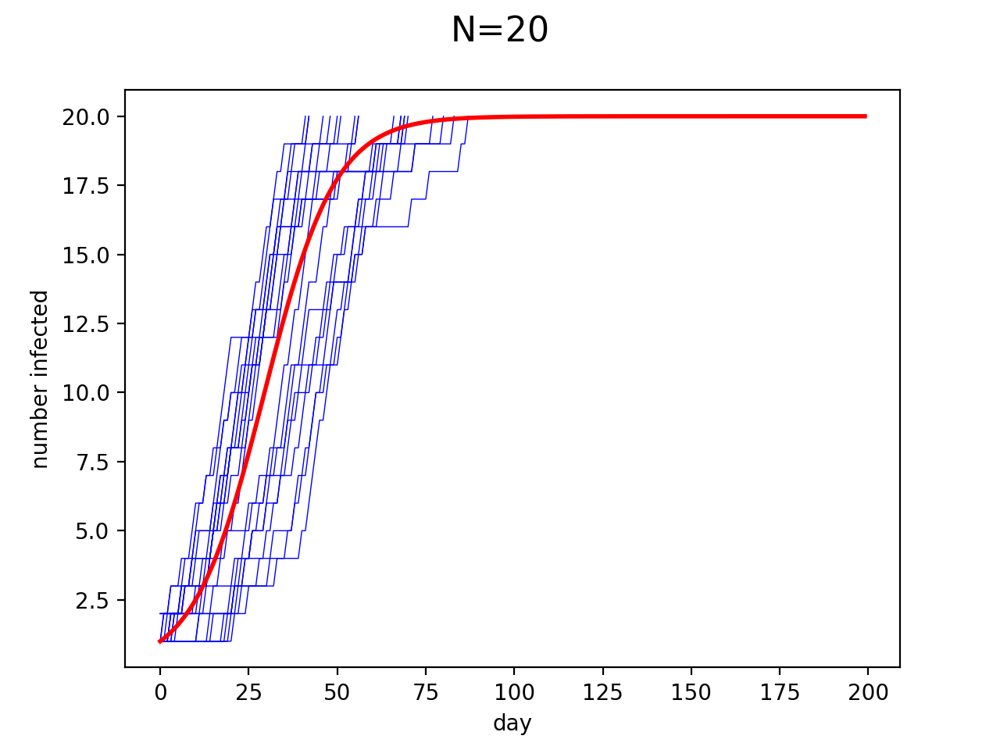
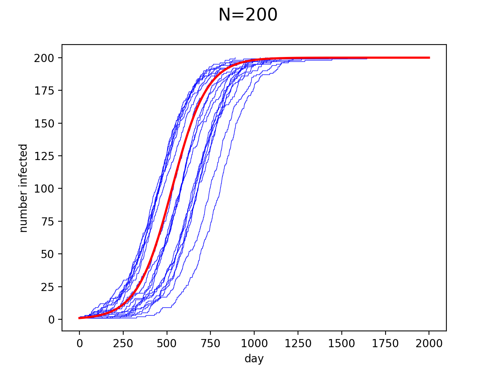
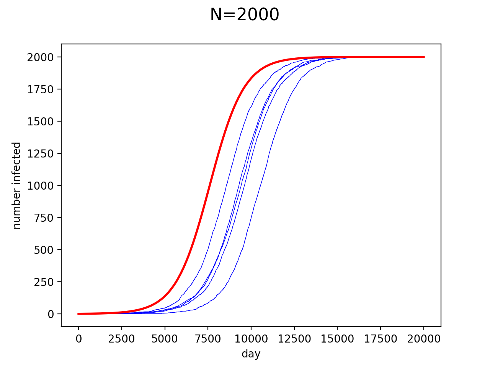

# Algorithm
Setup:

 - Start with N people, including one who is 'infected
 - Each 'day' (timestep) chose two random people to interact
    - If one person is infected, the infection spreads to the other person

## Simplifications

- no recovery (normally, people don't stay sick/contagious forever)
- random transmission (normally, people group together in houses, cities, and countries)

# Results

Raw results for various population sizes (values for N):

# Logistic growth?
The graphs look a lot like the [Logistic Growth](https://en.wikipedia.org/wiki/Logistic_function) equations used in ecology:

In ecology, populations growth is modelled by the equation:

Where:
  - t is time (in our case measured in days)
  - K is maximum population (in our case, this is the maximum number of infected people, so K=N)
  - r is [relative growth rate](https://en.wikipedia.org/wiki/Relative_growth_rate) (see below for more discussion)
  - S is starting population (in our case, S=1)

## Growth Rate (r)

From the ~~wikipedia page~~ rigorous research, it's unclear what exactly r represents, and what the the number would be in this case.

**Failed method 1:**

One interpretation of r:
  - when overpopulation is not an issue
  - given starting population (S)
  - and the expected population after one day (E)
  - r = E/S

In our case, overpopulation is least applicable when only 1 person is infected, so S = 1.
There is a 1/N chance the population will increase to 2, and (N-1)/N chance the population will remain unchanged.

So, E = [ 2*(1/N) + 1*[(N-1)/N] ] = 1 + 1/N
And r = E/S = 1 + 1/N

Trying that, with N = 200, and all the other values plugged in gives us:

Nope! r = 1 + 1 / N looks very wrong.

**Failed method 2:**

Another method to calculate r uses the same E as above, then:

r = ln(E) - ln(S) = ln(1 + 1/N)

Trying that, looks like:

It's better, but still doesn't look like a match -- our simulation infects everyone twice as quickly as this model predicts.

**Guessing time!**

I tried a bunch of values for r, and found r = 2/N worked well:

Lets take a look at the r = 2/N model with different values of N, and a bunch of trials to make sure it's not a fluke:

This looks pretty good. However, in a majority of cases, the number infected takes longer to increase than the model predicts. This is most obvious in the N=2000 case, suggesting that the model gets less accurate as N increases.

**This time starting when S=N/2**

Maybe r referrers to the fastest growth rate, which would be when half the population is infected.

In this case, the chance we get 1 infected person and 1 uninfected person is 1/2.

So E = (1/2) * (N/2 + 1) + (1/2) * (N/2) = (N+1)/2
r = E/S = [(N+1)/2] / (N/2) = 1 + 1/N
This gives us exactly what we got from the first failed model, which implies that whatever it is this calculates remains constant throughout the simulation.

What about using this E for the second failed model?

r = ln(E) - ln(S) = ln((N+1)/2) - ln(N/2) = log(1 +1/N) ...exactly the same as failed model 2.

So, it looks like calculating the growth rate at different times doesn't change anything.

## Conclusion

Instructions unclear. Started a zombie apocalypse.
